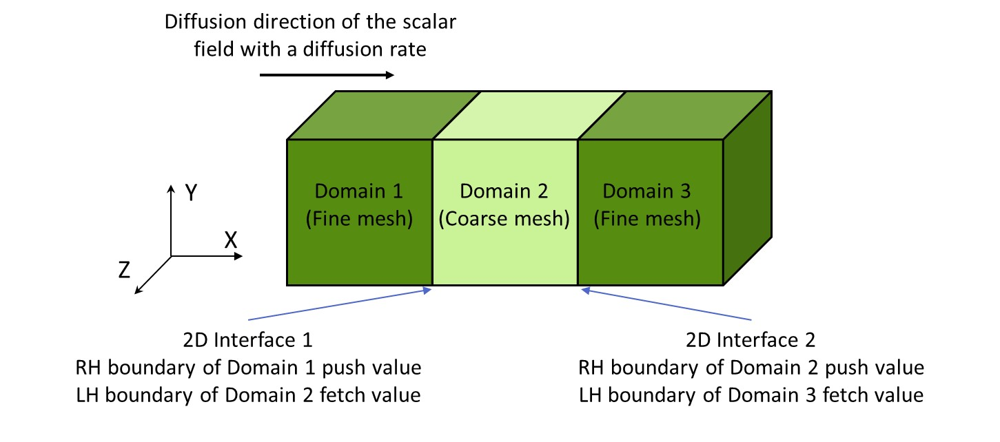
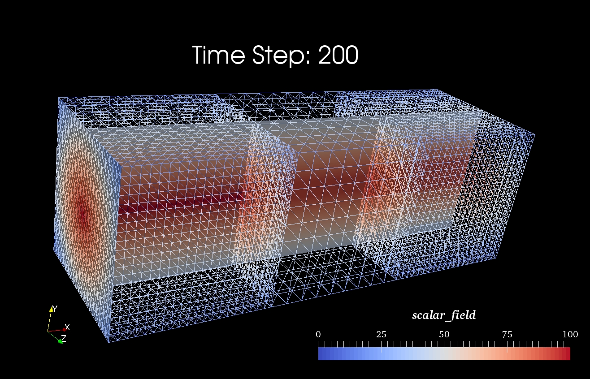

# MUI Demo: 7-pseudo-diffusion
This demo of the MUI Multiscale Universal Interface is a 3D scalar field pseudo diffusion case. The `3D_pseudo_diffusion_fine` file generates two discontinuous domains (left domain and right domain viewed towards the negative z-axis direction) with a fine mesh density, while the `3D_pseudo_diffusion_coarse` file generates one middle domain to "connect" the left and right domains with coarse mesh density. These three domains have the same dimension and align in the x-axis direction. The minimum x-axis boundary of the left domain has a scalar field source, which have a maximum value at the boundary centre and gradually decreases to outward. With the time increases, the scalar field diffuses along the positive x-axis direction. At each time instants, the left boundary of the middle domain fetches the field values from the right boundary of the left domain and the right boundary of the middle domain push field values to the left boundary of the right domain through MUI 2D interfaces with the RBF spatial sampler.

| Sketch of this demo |
|:------------------------------------------------------------------------------------------------------------------:|
|                                                                            |

| Result at time-step = 200 |
|:------------------------------------------------------------------------------------------------------------------:|
||

This demo shows how to:
 1. Use the spatial sampler of Radial Basis Function;
 2. Use the configure file for the MUI uniface

This demo contains:
 1. 3D_pseudo_diffusion_fine.cpp & 3D_pseudo_diffusion_coarse.cpp: coupling domains; 
 2. demo7_config.h: configure file of the MUI uniface;
 3. 3D_pseudo_diffusion_standalone.cpp: domain that runs standalone;
 4. CMakeLists.txt: CMake file;
 5. README.md

## Licensing

The source code is dual-licensed under both GPL v3 and Apache v2.

## Usage

To run the examples you need a `mpic++` wrapper with C++11 enabled backend and `Eigen3` installed.

To run the demo:

```bash
export CMAKE_INCLUDE_PATH=/path/to/MUI/
cmake .

make > make.log 2>&1

mpirun -np 1 ./3D_pseudo_diffusion_fine :\
       -np 1 ./3D_pseudo_diffusion_coarse >\
		parallel.log 2>&1
        
./3D_pseudo_diffusion_standalone
```

To visualize the results:

Open `paraview` and read .csv files from the results folder.

Use `TableToPoints` filter to generate points and use `Delaunay3D` filter to generate 3D volume.

The `Slice` filter can be used to generate slice of the domains and `contour` filter can be used to illustrate the scalar field contours.

The integration of the scalar field:

The instantaneous integration of the scalar field of each boundary faces that perpendicular to the x-axis direction is in faceIntegrationD1_D3.txt and faceIntegrationD2.txt of the results folder.  

## Contact

Should you have any question, please do not hesitate to contact the MUI team at STFC
